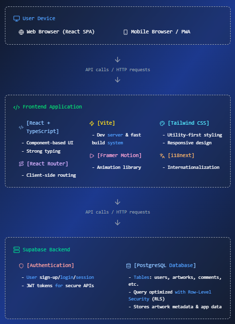

# **KalaKriti: Celebrating Indian Folk Art** 🎨


Welcome to **KalaKriti**, a digital platform dedicated to preserving, promoting, and engaging with Indian folk art. Our mission is to empower artists by providing them a space to showcase their creativity and connect with a global audience.

## 📜 **Table of Contents**

- [**KalaKriti: Celebrating Indian Folk Art** 🎨](#kalakriti-celebrating-indian-folk-art-)
  - [📜 **Table of Contents**](#-table-of-contents)
  - [🚀 **Introduction**](#-introduction)
  - [✨ **Key Features**](#-key-features)
    - [🌍 **Explore Artworks**](#-explore-artworks)
    - [🎨 **Artist Profiles**](#-artist-profiles)
    - [🖼️ **Upload and Showcase Art**](#️-upload-and-showcase-art)
    - [🔎 **Search \& Filters**](#-search--filters)
    - [💬 **Community Engagement**](#-community-engagement)
  - [💻 **Technology Stack**](#-technology-stack)
  - [🛣️ **Workflow**](#️-workflow)
  - [🧰 **Prerequisites**](#-prerequisites)
  - [🚀 **Getting Started**](#-getting-started)
    - [1. Clone the repository:](#1-clone-the-repository)
    - [2. Install dependencies:](#2-install-dependencies)
    - [3. Set up Supabase:](#3-set-up-supabase)
    - [4. Start the development server:](#4-start-the-development-server)
    - [5. Build for production:](#5-build-for-production)
  - [🧪 **Development Tips**](#-development-tips)
  - [🤝 **Contributions**](#-contributions)
  - [🔒 **License**](#-license)

---

## 🚀 **Introduction**

<p align="center">


</p>

**Kalakriti** is a dynamic platform that celebrates Indian folk art and gives artists the tools they need to preserve and share their work with the world. We enable artists to:

* 🌍 Showcase their art to a global audience
* 🖼️ Share their journey and connect with others
* 💡 Engage in a community-driven platform
* 🎨 Provide tools for both emerging and established artists

Our goal is to create a **sustainable ecosystem** where art and culture thrive in the digital space.

---

## ✨ **Key Features**

### 🌍 **Explore Artworks**

* Browse an extensive collection of Indian folk art styles.
* View artworks based on different themes, regions, and styles.

### 🎨 **Artist Profiles**

* Artists can create their profiles and share their portfolios.
* Showcase artworks with rich details including title, description, and tags.

### 🖼️ **Upload and Showcase Art**

* Artists can upload high-resolution images of their artworks.
* Provide context (e.g. verified badges) and engagement options. 

### 🔎 **Search & Filters**

* Use search functionality to explore artworks based on style, region, and keywords.
* Apply filters for an enhanced, personalized browsing experience.

### 💬 **Community Engagement**

* Like and comment on artworks to engage with the community.
* Connect with artists through their profiles and share thoughts on their work.

---

## 💻 **Technology Stack**

* **Frontend**: React (with Vite for fast development)
* **Styling**: Tailwind CSS
* **Backend**: Supabase (Auth, Database, File Storage)
* **Deployment**: Vercel (for frontend)

---

## 🛣️ **Workflow**




---

## 🧰 **Prerequisites**

* Node.js 18+ and npm 9+
* A Supabase project (for Auth, Database, and Storage)

---

## 🚀 **Getting Started**

### 1. Clone the repository:

```bash
git clone https://github.com/flurry101/kalakriti.git
cd kalakriti
```

### 2. Install dependencies:

```bash
npm install
```

### 3. Set up Supabase:

* Create a project on [Supabase](https://supabase.com/).
* In the project settings, copy your Project URL and anon public key.
* Create a `.env` file in the project root with the following keys (Vite requires the `VITE_` prefix):

```bash
VITE_SUPABASE_URL=your_supabase_url
VITE_SUPABASE_ANON_KEY=your_supabase_anon_public_key
```

### 4. Start the development server:

```bash
npm run dev
```

The app will be available at `http://localhost:5173`.

### 5. Build for production:

```bash
npm run build
```
---

## 🧪 **Development Tips**

- **Environment variables**: Vite exposes variables prefixed with `VITE_` via `import.meta.env`.
- **Supabase client**: Initialized in `src/lib/supabaseClient.ts`.
- **Routing**: Implemented with `react-router-dom` under `src/pages/`.

---

## 🤝 **Contributions**

We welcome contributions to **KalaKriti**! Whether it's reporting bugs, suggesting new features, or submitting code, your input is invaluable. To contribute:

* **Fork the repository** and create a new branch.
* **Make changes**, following the project guidelines.
* **Submit a pull request** with a detailed explanation of your changes.

For detailed instructions, please refer to our [Contributing Guide](Contributing.md).

Thank you for helping us bring Indian folk art to the world!

---

## 🔒 **License**

This project is licensed under the **MIT License**. See the [LICENSE](LICENSE.md) file for more details.

---

Crafted with 🧡 for the rich tapestry of India's **art** and **culture**.

---

